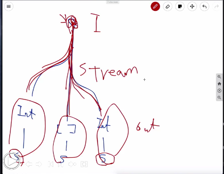

Rxswift 정리

## Stream

반응형 -> 나중에 생기는 데이터 Observable 이라는 class로 감싸서 전달한다.

Youtube 주소
https://youtu.be/iHKBNYMWd5I

RxSwift 비동기로 생기는 결과값을 completion으로 전달하는게 아니라(클로져)
return값으로 전달해주기 위해서 생긴 유틸리티이다.

비동기로 생기는 데이터를 retrun 값으로 전달해준다.
나중에 생기는 데이터 class

비동기로 생기는 데이터를 return 값으로 전달하기 위해서
나중에 생기는 데이터 Observable 이라는 class로 감싸서 전달한다.

Observable -> 나중에 생기는 데이터
Observable를 만들어서 리턴하는데 만들 때는 create()를 만든다.
바로 전달하는게 아니라 
onNext라고 하는 메소드를 통해서 리턴하게 된다.

Subscribe-> 데이터가 나중에 오면! 이벤트가 온다.
Next, error, complete  3개 온다.

Observable형태로 감싸서 리턴하면 나중에 생기는 데이터다.
나중에 생기는 데이터를 사용할 때는 나중에 오면을 호출하면 된다. (Subscribe)
그러면 event가 오는 데, event는 next, error, complete

Error -> 에러
Complete -> 데이터가 전달되고 끝났을 때
Next-> 데이터가 전달될 때

순환참조는 weak self
클로져에서 self를 사용을 하게되면 레퍼런스 카운트가 올라가기 때문에,
순환참조가 발생할 수 있지만

발생했다가 사라지게 하는 방법은 complete시키면 역할을 다했다고 생각해서 
onNext를 주고나서 onCompleted로 해주면 클로져의 역할은 끝났기 때문에 스스로 사라진다.
그러므로 레퍼런스 카운트가 사라지게된다.
쿨로저가 들고있는 self의 레퍼런스카운트가 사라진다.

1. 비동기로 생기는 데이터를  Observable로 감싸서 리턴하는 방법
2.  Observable로 오는 데이터를 받아서 처리하는 방법
3. 

Observable의 crate를 한다.
거기에 에러를 호출하거나 next로해서 데이터를 전달하거나 혹은 complete으로 종료를 시킨다.
취소됏을 때 해야하는 행동이 있다면
Observable을 create해서 return하는 그 사이에 취소했을 때 해야되는 행동을 집어넣어준다.

onnext는 여러개 전달이 되도 된다.
Observable의 끝은 complete이 불렸을 때 끝난다.

Create -> subscribe -> next로 데이터 전달 되다가 -> complete되면서 끝난다.

Observable의 생명주기
1.  Create
2.  Subscribe
3. onNext  
4.  ----  끝 ———
5. onCompleted  / onError 에러가 나도 끝난다.
6. Disposed

주의사항
한 번 만들어진 Observable은 Subscribe에 의해서 동작이 시작되고,
한 번 Subscribe에 의해서 동작이 시작되면 complete 이나 error나 dispose에 의해서 동작이 끝난다.
동작이 끝난 Observable은 다시 재사용이 불가하다.
한 번 complete되거나 error로 끝난 애들은 다시 재사용이 되지않는다.

Create 됐다고 해서 모든 데이터가 생성이 되거나 전달이 되거나 하지않는다.
Observable은 Subscribe됐을 때 동작한다. -> create안에 클로져가 실행된다.

subscribe에 의해서 결과가 리턴된다.

추가적인 귀찮은 것들을 없애주는 것이 있다.

56분 17초부터 다시 듣기

사용법이 너무 길다. 귀찮다.
귀찮은 방법을 없애주는 sugar 적인 방법이 있다.

 Observable.just
 데이터 하나 보내는 것은 이렇게 만들자.
 
 just를 쓰면 onNext, onCompleted, disposed를 한 번에 쓸 수 있다.
 하나만 전달할 거면 just를 써도 된다.
 
 데이터가 내려간다는 의미는 Next에서 데이터를 받는 다는 의미로 알면 된다.
 just에는 어느 객체가 와도 상관없다. 배열도 상관없지만 함수 이름에서 리턴할 값의 타입이 일치하여야한다.
 
 observeOn = DispatchQueue.main.async 메인큐와 같다.
 observeOn(Mainscheduler.instance) --> sugar: operator
 데이터를 사이에서 전달해줄 때 뭔가 처리해주는

데이터를 중간에 바꾸는 sugar들을 operator라고 한다.
just나 from은 생성을 할 때 만들어주는 sugar

데이터가 Observable에서 Subscribe사이로 데이터가 전달되는 중간에 데이터를 바꿔치기하는 것들을 
operator라고 한다.

 observeOn
 
 
 Just - 데이터가 하나 생성되고 complete
 위에 구슬이 데이터
 밑에 가로 화살표는 Observable
 just를 감싸고 있는 네모는 Operator
 새로 작대기는 Complete
 
 
 From - 배열을 create 시켜서 하나씩 꺼낸다.
 
 Map -> 위도 Observable 아래도 Observable
 Map은 처음부터 쓸 수 있는게 아니라 뭔가 Observable이 있어야 쓸 수 있다.
 Observable와 Observable사이에 Map을 쓸 수 있다.
 
 filter
 
 ObserveOn은 위에도 Observable 아래도 Observable
 검정 화살표에서 주황색 화살표로 바뀜
 색이 바뀐건 쓰레드가 바뀐거라고 생각하면 됌
 그 다음줄에 영향을 준다.
 아래로 간다.
 DownStream에 영향을 준다.
 
 SubscribeOn
 default qos를 갖는 DispatchQueue 쓰레드에서 처음부터(downloadJson)부터 observeOn 에서 쓰레드가 전환된다.
 첫 번째 어디쓰레드에서 동작할 건지를 지정해주는 거기 때문에 subscribeOn은 위치가 상관없다.
 위치에 상관없이 맨 처음 쓰레드의 시작을 지정해준다.
 그러니까 위로간다.
 UpStream에 영향을 준다.
 
 Scan

1 2 3 4 5 -|>
 Scan((x, y) => x + y)
1 3 6 10 10 15 -|>

방금 전에 내렸던 값이 x
위에서 새로들어온 값이 y 
두개를 가지고 핸들링을 하겠다는 것으로 보면된다.

Observable 을 생성하는 방법이 있고 Subscribe 해서 사용하는 방법이 있다.
emitter을 create해서 emitter에다가 next complete 등을 호출해서 생성하는 방법이고
subscribe해서 event를 받아서 처리하는 방법이 기본적인 방법이다.

제공해주는 sugar들을 operator라고 부른다.
create도 operator //Just, From
subscribe도 operator //특정 이벤트만 받아서 처리, onNext
중간에 데이터를 조작하는 것도 operator // map, filter, subscribeOn 등

operator는 엄청나게 많이 있다. 마블 다이어그램에 의해서 동작을 소개하고 있다.
http://reactivex.io/

Creating, Transforming, Filtering, Combining(여러가지 Observable을 join하거나 묶어서 처리하거나 하는), Error Handling,  Observable Utility

제일 많이 쓰는 Combining operator는
Merge, Zip, CombineLatest

Merge -> 단순하게 여러개의 Observable이 나오는 순서대로 합쳐준다.
데이터 타입이 같아야 합칠 수 있다.

Zip -> 위 Observable 아래 Observable 생성되면 하나씩 쌍으로 만들어서 내려보내준다.
두 개의 데이터가 생성이되면 쌍으로 만들어서 내려보내준다.
데이터 타입이 달라도 상관이 없다.

CombineLatest -> 위 Observable 아래 Observable 생성되면 가장 최근에 생성된 Observable을 쌍을 만들어서 보내준다.

 여러개 subscribe를 하다가 화면을 나갈경우가 생긴다면
 var disposable : [Disposable] = []
 
 
 
 subscribeOn, observeOn 에는 스케쥴러를 넣어준다.
 OperationQueue를 래핑해서 스케쥴러 라는 것을 만든 것이다.
 
 
 Step2는 소스 참고 용이고,
 Step3 Empty를 가지고 rxCocoa + MVVM을 적용해본다.
 1:45 분부터 시청할 것.
 
 
 3번째 공부
 RxCoCoa -> Rxswift에 기능을 UIKit에 Extensions을 추가함.
 
 
 Step3 RxSwift+MVVM
 Observable에다가 어떻게 넣어줄 수 있나.
 Observable은 값을 넘겨주는 애지, 외부에서 받아서 넘겨주는 애가 아니다.
 
 Observable처럼 값을 받아먹을 수 있는 애지만, 외부에서 컨트롤할 수는 없을까?
 그래서 나온게 Subject
 
 Subject
 Observable 밖에서 데이터를 컨트롤을 해서 새로운 값을 Next값을 만들어 줄 수 있는 것을 Subject
 
 Create했을 때 받았던 Emitter
 Create안에서만 쓰이는 게 아니라, 이미 만들어져 있는 Observable밖에서 값을 바꿀 수 있다.
 
 AsyncSubject
 여러 놈이 Subscribe구독하더라도, 데이터를 다 안내려보내주다가
 Complete되는 시점에 데이터를 다 내려주고 Complete시킨다.
 
 
 BehaviorSubject
  기본 값을 하나 가지고 시작한다.
  초기값을 꼭 가진다. 빈 배열이라도 넣어주자!
  
 누군가가 subscribe하자마자 기본값을 내려준다.
 아직 데이터가 생성되지 않았을 때, 기본값을 내려주고 시작한다.
 데이터가 생기면 그 때마다 계속 내려보낸다.
 새로운 놈이 중간에 Subscribe를 하게되면, 가장 최근에 발생했던 그 값을
 일단 내려주고 나서, 다음부터 발생하는 데이터를 모든 Subscribe하는 애들한테 내려보낸다.
 
 
 PublishSubject
 
 Subject에 누군가 Subscribe()할 수가 있다.
 내부에서 데이터가 생성이 되면 그대로 내려보내준다.
 다른 subscribe할 수 있고, 또 데이터가 생기면 Subcribe하는 모든 놈들한테 
 데이터를 보내준다.
 
 ReplaySubject
Subscribe했을 때 데이터를 내려보내준다.
여기까지는 Publish와 동일하다.
두번째로 Subscribe했던 놈은 여태까지 전달됐던 것을 한꺼번에 모두 내려준다.
그 이후로 발생한 데이터는 같이 내려준다.

제일 많이 쓰는 것은 Publish와 Behavior이다.

RxCoCoa는 RxSwift의 요소들을 UIKit에 Extensions를 해서 접목시킨다.

label.rx.text => Rx에서 제공되는 요소
Binder<string?> 바인드를 시킬 수 있다.

Step3다시 볼 것!!

.bind(to: totalPrice.rx.text) 
.subscribe(onNext : { [weak self] in
             self?.totalPrice.text = $0
})
같은 것이다.
bind는 [weak self]를 사용해주면 순환 참조를 사용할 필요가 없다.

2:42 초부터

         
         
화면에 어떤 내용을 그려야할지, ViewModel에서만 처리한다.
View, Cell에는 화면에 요소만 가지고 잇는 것들을 Action은 ViewModel에 넘긴다.
모든 생각과 데이터에 대한 처리는 viewModel이 한다.
View는 그리기만 한다.

 어떤 로직을 정해야할지는 ViewModel
 어떤 데이터를 보여줘야되느냐 그 데이터를 보여주는데 Clear나 +,-를 누르면 어떤 처리를 해줘야하는지는.
 ViewModel이 알고 있다.
 에러가 있다면 viewModel이 알고 있다.
 tableViewCell에서 - 누르면 -값으로 내려간다. -> viewModel이 해줘야한다.
 
viewmodel에 menuCount는 문자로 바꿔서 text에 값을 줍니다.
totalPrice가 나오면 통화형태로 바꿔서 text에 값을 줍니다.
ViewController에는 view의 요소만 잡아서 어떤 형태로 화면에 뿌릴지 지정한다.

viewModel으로 TestCase만드는게 제일 쉽다.

MVVM 정리
기획서 , 서버, 디자인. 클라이언트,
동시에 개발 진행을 시작한다.
뷰에 필요한 모델은 viewModel로 따로 만든다.
실제로 데이터가 나오면 실제 Model로 만든다.
클라이언트 입장에서는 도메인에서 오는 모델이기때문에 Domain Model이다.
도메인 모델은 화면에 보여줘야하는 ViewModel과는 다르다.
count로 갖고있다. 화면에 보여줘야하는 ViewModel
View에서 필요한 파라미터들이 더 필요할 수 있다.
View에 필요한 ViewModel으로 사용한다.
아키텍쳐 ViewModel

Model - View - ViewModel

ViewModel
도메인의 Model과 View에서 쓰이는 Model
아키텍쳐에서 말하는 ViewModel ViewModel이 View에 그려라 하는 것을 지시하지 않는 다.
View가 ViewModel을 바라보면서 값을 어떻게 바꿀지 기다리는 것이다.
데이터 요소를 갖고 있는데, 데이터 요소가 바뀌기만 하면 알아서 뷰가 바뀐다.
ViewModel이 View에게 그리라고 시키지않는다.
View는 그려야될 요소가 있는 데, 보고 있다가 바뀌면 갱신하는것이다. 
데이터 바인딩이라고 한다.

어떤 뷰는 리스트, 썸네일로 보여지더라도, 보여지는 형태만 다르기때문에,
하나의 ViewModel을 사용할 수 있다.

Subject
Data Control
Hot Observable / Cold Observable

Subject를 왜 사용했냐면
Observable은 데이터가 이미 정해진 어떠한 데이터가 내보낼지가 미리 정해져있는 형태의 Stream이다.
Create할 때부터 어떤 데이터를 내보낼지가 정해져있다.
추가적으로 런타임에 외부 컨트롤에 의해서 데이터가 동적으로 생성되는 타입이 아니다.
Observable 밖에서 데이터를 주입시켜주는 것이 필요했다.
데이터를 넣어줄 수도 있고, 구독할 수도 있는 양방향성이 가지고 있는 것이 필요했고
그것이 Subject
Subject에는 만들어놓으면 밖에서 onNext해서 데이터를 넣어줄 수도 있고, onError, onCompleted로 끝낼 수도 있다.
일반 Observable처럼 Subscribe도 할 수 있었다.

RxCocoa
UI 작업의 특징
Observable / Driver
Subject / Relay

UIKit.rx

UI에 대한 작업의 특징
1. 항상 UI쓰레드에서만 돌아야한다.
2. .observeOn(MainScheduler.instance)는 항상 들어가야한다.
3. 보통 아웃렛으로 처리하거나 인스턴스 만들어서 밖에서 꺼내놓는 경우가 많아 self가 쓰는경우가 많다.
4. 순환참조를 쓰는 경우가 많다.
5. 데이터를 처리하다가 중간에 에러가 나면 Stream이 끊어진다. 재활용이 되지않는다.
화면을 그리다가 에러가 났을 때, Stream이 끊어져버려서 눌러도 동작이 되질않는다.
6. 에러가 난다고 해서 Stream이 끊어지면 안된다.

끊어지면 안되기때문에 이런 처리가 있다.
.catchErrorJustReturn("")
.observeOn(MainScheduler.instance)
에러가 발생하면 빈 문자열이 내려간다.

항상 매번 처리하기 귀찮으니까
asDriver라는 것을 만들었다.
.asDriver(onErrorJustReturn:"") 에러가 들어갔을 때 기본값을 넣어주고 나면
.dirve(itemCountLabel.rx.text) 
Subscribe나 bind를 하는 것이 아니고 Driver에 대해서는 Drive를 한다.
driver는 에러가 나는 경우에 대해 바꿔서 처리를하고 항상 메인 쓰레드(UI쓰레드)에서 돌아간다.

Subject도 에러가 발생해도 끊어지지않는 Subject가 필요할 수 있다.
Subject도 끊어지지 않는 Subject를 만들었다.
BehaviorSubject -> BehaviorRelay 에러가 나도 끊어지지않는다. RxRelay import 해야한다.
이걸 쓸 경우 onNext가 아니라 accept로 바뀐다.

         